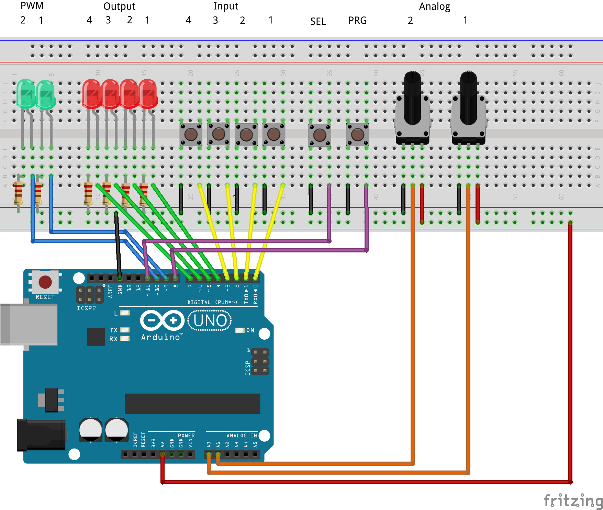

# Arduino TPS in 4 Schritten

## Hardware

Hier eine Übersicht über die Ein/Ausgabepins der TPS und deren Entsprechung auf dem Arduino. Anschlüsse:

| TPS Anschlüsse | Arduino Pins |
| -------------- | ------------ |
| Din1..4        | D0..D3       |
| Dout1..4       | D4..D7       |
| PWM1,2         | D9,10        |
| ADC1,2         | A1,2         |
| SW_PRG (S2)    | D8           |
| SW_SEL (S1)    | D11          |

## Step 1

Ist so wie bei Burghard beschrieben.

## Step 2

Hier ebenso

## Step 3

Es gibt ein paar Anpassungen zu Burghards Version.

- Es gibt zusätzlich einen zweiten ADC und einen zweiten PWM.
- Befehl 0x50 SWAP A/B ist hinzugekommen
- Es gibt neue Berechnungen, 
  - den Rest einer Division (A= A % B) 
  - Umgekehrte Subtraktion A = B - A
  - Recht und Links Shift A = A SHR 1 u. A = A SHL 1 
    Diese verschieben den Inhalt des Registers A entweder nach links SHL (was  eine Multiplikation mit 2 entspricht) oder nach rechts  (SHR). Das wäre dann eine Division durch 2. 

## Step 4

## Befehlssatz

In eckigen Klammern stehen jeweils die entsprechenden Mnemonics des [SPS Assemblers](https://wkla.no-ip.biz/ArduinoWiki/doku.php?id=arduino:arduinosps:tpsass).

|      | 0         | 1           | 2            | 3                         | 4         | 5                | 6           | 7                     |
| ---- | --------- | ----------- | ------------ | ------------------------- | --------- | ---------------- | ----------- | --------------------- |
|      | n.n.      | Port [DOUT] | Delay [WAIT] | Jump back relative [RJMP] | A=# [LDA] | =A               | A=          | A=Ausdruck            |
| 0    | NOP [NOP] | aus         | 1ms          | 0                         | 0         | A<->B [SWAP]     |             |                       |
| 1    |           | 1           | 2ms          | 1                         | 1         | B=A [MOV]        | A=B [MOV]   | A=A + 1 [INC]         |
| 2    |           | 2           | 5ms          | 2                         | 2         | C=A [MOV]        | A=C [MOV]   | A=A - 1 [DEC]         |
| 3    |           | 3           | 10ms         | 3                         | 3         | D=A [MOV]        | A=D [MOV]   | A=A + B [ADD]         |
| 4    |           | 4           | 20ms         | 4                         | 4         | Dout=A [STA]     | Din [LDA]   | A=A - B [SUB]         |
| 5    |           | 5           | 50ms         | 5                         | 5         | Dout.1=A.1 [STA] | Din.1 [LDA] | A=A * B [MUL]         |
| 6    |           | 6           | 100ms        | 6                         | 6         | Dout.2=A.1 [STA] | Din.2 [LDA] | A=A / B [DIV]         |
| 7    |           | 7           | 200ms        | 7                         | 7         | Dout.3=A.1 [STA] | Din.3 [LDA] | A=A and B [AND]       |
| 8    |           | 8           | 500ms        | 8                         | 8         | Dout.4=A.1 [STA] | Din.4 [LDA] | A=A or B [OR]         |
| 9    |           | 9           | 1s           | 9                         | 9         | PWM.1=A [STA]    | ADC.1 [LDA] | A=A xor B [XOR]       |
| a    |           | 10          | 2s           | 10                        | 10        | PWM.2=A [STA]    | ADC.2 [LDA] | A= not A [NOT]        |
| b    |           | 11          | 5s           | 11                        | 11        |                  |             | A= A % B (Rest) [MOD] |
| c    |           | 12          | 10s          | 12                        | 12        |                  |             |                       |
|      |           | 13          | 20s          | 13                        | 13        |                  |             | A= B - A[BSUBA]       |
| e    |           | 14          | 30s          | 14                        | 14        |                  |             | A=A SHR 1 [SHR]       |
| f    |           | 15          | 60s          | 15                        | 15        |                  |             | A=A SHL 1 [SHL]       |

Zus. Features in der Arduino_TPS Version:

-  Es gibt neue Befehle: Swap (0x50)  vertauscht A und B Register
-  Es gibt neue Berechnungen, 
   - den Rest einer Division (A= A % B) 
   - Umgekehrte Subtraktion A = B - A
   - Recht und Links Shift A = A SHR 1 u. A = A SHL 1 
     Diese verschieben den Inhalt des Registers A entweder nach links SHL (was  eine Multiplikation mit 2 entspricht) oder nach rechts  (SHR). Das wäre dann eine Division durch 2. 

|      | 8           | 9                              | a                                                     | b                                                    | c                 | d                         | e           | f            |
| ---- | ----------- | ------------------------------ | ----------------------------------------------------- | ---------------------------------------------------- | ----------------- | ------------------------- | ----------- | ------------ |
|      | Page [PAGE] | Jump absolut (#+16*page) [JMP] | C* C>0: C=C-1;             Jump # + (16*page) [LOOPC] | D* D>0:D=D-1;             Jump # + (16*page) [LOOPC] | Skip if           | Call # + (16*Page) [Call] | Callsub/Ret | Byte Befehle |
| 0    | 0           | 0                              | 0                                                     | 0                                                    | A==0 [SKIP0]      | 0                         | ret [RTR]   |              |
| 1    | 1           | 1                              | 1                                                     | 1                                                    | A>B [AGTB]        | 1                         |             |              |
| 2    | 2           | 2                              | 2                                                     | 2                                                    | A<B [ALTB]        | 2                         |             |              |
| 3    | 3           | 3                              | 3                                                     | 3                                                    | A==B [AEQB]       | 3                         |             |              |
| 4    | 4           | 4                              | 4                                                     | 4                                                    | Din.1==1 [DEQ1 1] | 4                         |             |              |
| 5    | 5           | 5                              | 5                                                     | 5                                                    | Din.2==1 [DEQ1 2] | 5                         |             |              |
| 6    | 6           | 6                              | 6                                                     | 6                                                    | Din.3==1 [DEQ1 3] | 6                         |             |              |
| 7    | 7           | 7                              | 7                                                     | 7                                                    | Din.4==1 [DEQ1 4] | 7                         |             |              |
| 8    | 8           | 8                              | 8                                                     | 8                                                    | Din.1==0 [DEQ0 1] | 8                         |             |              |
| 9    | 9           | 9                              | 9                                                     | 9                                                    | Din.2==0 [DEQ0 2] | 9                         |             |              |
| a    | 10          | 10                             | 10                                                    | 10                                                   | Din.3==0 [DEQ0 3] | 10                        |             |              |
| b    | 11          | 11                             | 11                                                    | 11                                                   | Din.4==0 [DEQ0 4] | 11                        |             |              |
| c    | 12          | 12                             | 12                                                    | 12                                                   | S_PRG==0 [PRG0]   | 12                        |             |              |
| d    | 13          | 13                             | 13                                                    | 13                                                   | S_SEL==0 [SEL0]   | 13                        |             |              |
| e    | 14          | 14                             | 14                                                    | 14                                                   | S_PRG==1 [PRG1]   | 14                        |             |              |
| f    | 15          | 15                             | 15                                                    | 15                                                   | S_SEL==1 [SEL1]   | 15                        |             |              |

Zus. Features in der Arduino_TPS Version:

-  Weil wir genug EEPROM haben ist der Page Bereich auf 16 Seiten ausgedehnt. Macht also ins. 256 Bytes
-  Beim Skip gibt’s noch den A=0 Befehl.
-  FF bedeutet Programmende. → automatischer Sprung nach 0.